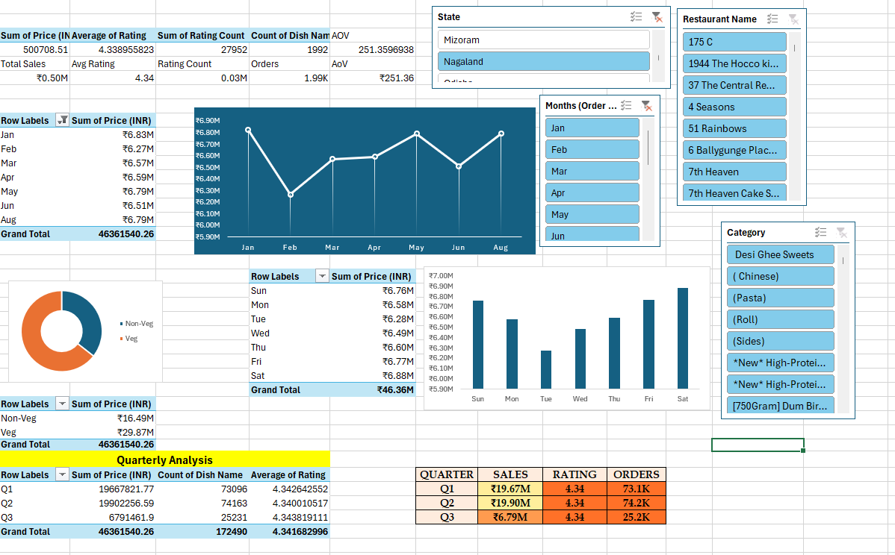

# Swiggy Food Delivery Data Analysis 🍽️📊

An interactive Excel-based data analysis project exploring food delivery trends, sales performance, restaurants, categories, ratings, and geographic patterns using Swiggy data.

## 📊 Project Overview

This project analyses food delivery data to identify meaningful patterns in sales, customer ratings, restaurant performance, food categories, and geographic distribution.

The analysis was performed using Microsoft Excel with PivotTables, PivotCharts, slicers, KPI calculations, and interactive dashboards.

## 🔍 Key Areas of Analysis

- Sales performance over time
- Restaurant-level analysis
- Food category analysis
- State-wise sales performance
- Veg vs Non-Veg analysis
- Customer rating analysis
- Day-wise sales trends
- Quarterly performance
- Average Order Value (AOV)

## 🛠️ Tools & Skills

- Microsoft Excel
- PivotTables
- PivotCharts
- Slicers
- Data Analysis
- Data Visualization
- KPI Analysis
- Dashboard Development

## 📈 Dashboard


## 📊 Analysis



## 📌 Key Metrics

The dashboard provides an overview of:

- Total Sales
- Average Rating
- Rating Count
- Number of Orders
- Average Order Value (AOV)

## 📂 Project Structure

```text
Swiggy-data-analysis/
│
├── README.md
│
└── Swiggy_Excel_Analysis/
    ├── README.md
    └── assets/
        ├── dashboard.png
        └── analysis.png
