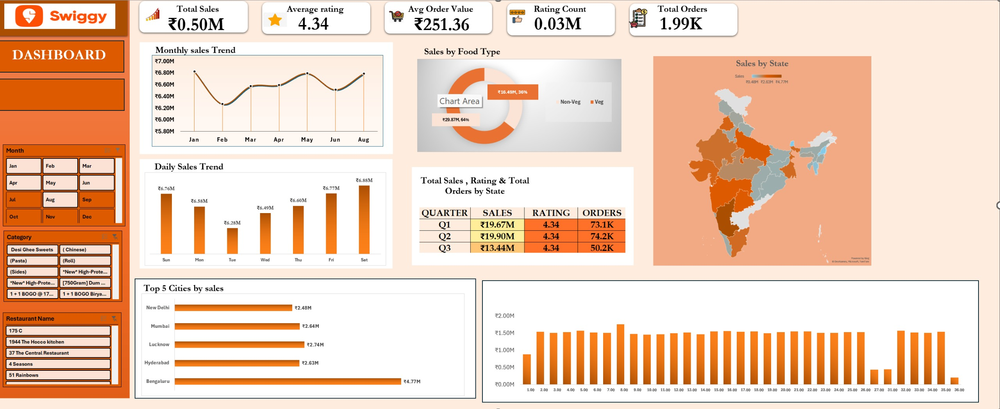

# Swiggy Food Delivery Data Analysis

## 📌 Introduction

This project analyses Swiggy food delivery data using Microsoft Excel to identify patterns in sales, food categories, restaurants, customer ratings, geographic performance, and order behaviour.

The project transforms raw food delivery data into business-oriented insights using PivotTables, PivotCharts, slicers, KPI calculations, and an interactive dashboard.

## 🎯 Project Objectives

The analysis focuses on:

- Understanding overall sales performance
- Analysing monthly and quarterly sales trends
- Comparing Veg and Non-Veg sales
- Identifying high-performing states
- Analysing restaurant-level performance
- Understanding food category trends
- Analysing customer ratings
- Comparing day-wise sales
- Calculating key business KPIs

## 📂 Dataset

The dataset contains approximately 197,430 records and includes information such as:

- State
- City
- Order Date
- Day
- Quarter
- Week
- Restaurant Name
- Location
- Category
- Dish Name
- Food Type
- Price
- Rating
- Rating Count

## 🛠️ Excel Skills Used

- PivotTables
- PivotCharts
- Slicers
- KPI calculations
- Data aggregation
- Data visualization
- Conditional formatting
- Dashboard development

## 📊 Key Performance Indicators

The overall analysis reports:

| KPI | Value |
|---|---:|
| Total Sales | ₹46.36M |
| Average Rating | 4.34 |
| Average Order Value | ₹251.36 |
| Orders in Quarterly Analysis | 172,490 |

> Dashboard KPIs are interactive and change based on the selected slicers and filters.

## 📈 Dashboard

The interactive dashboard provides a consolidated view of sales, ratings, orders, food type, and geographic performance.

## 📊 Analysis

The analysis sheet contains detailed breakdowns of sales across time, food type, states, restaurants, categories, and other dimensions.

## 🔍 Key Analysis & Insights

### 1. Overall Sales Performance

The analysis records total sales of approximately **₹46.36M**, with an overall average rating of **4.34** and an average order value of approximately **₹251.36**.

### 2. Monthly Sales Analysis

Monthly sales remained relatively consistent across the reported months.

**May recorded the highest monthly sales at approximately ₹6.79M**, closely followed by August at approximately ₹6.79M.

### 3. Day-wise Sales Analysis

Saturday generated the highest sales among the days analysed, with approximately **₹6.88M** in sales.

Tuesday recorded the lowest sales at approximately **₹6.28M**.

This represents a difference of approximately **₹0.61M** between the highest and lowest performing days.

### 4. Quarterly Analysis

Q2 recorded the highest sales among the reported quarters:

- **Q1:** ₹19.67M
- **Q2:** ₹19.90M
- **Q3:** ₹6.79M

Q2 also recorded approximately **74.2K orders**, compared with **73.1K orders in Q1**.

### 5. Food Type Analysis

Veg food contributed approximately **₹29.87M**, accounting for around **64.4% of total sales**.

Non-Veg food contributed approximately **₹16.49M**, accounting for around **35.6% of total sales**.

This indicates a substantially higher sales contribution from Veg food in the analysed dataset.

### 6. State-wise Analysis

**Karnataka recorded the highest state-level sales at approximately ₹4.77M.**

Other high-performing states included:

- Uttar Pradesh — ₹2.74M
- Maharashtra — ₹2.64M
- Telangana — ₹2.63M
- Delhi — ₹2.48M

Karnataka alone contributed approximately **10.3% of overall sales**.

### 7. Restaurant Analysis

Restaurant-level data was analysed to compare sales performance across restaurants and identify differences in contribution to overall sales.

Interactive restaurant filters allow users to explore individual restaurant performance through the dashboard.

### 8. Category Analysis

Food categories were analysed to understand their contribution to overall sales and to identify variations in customer demand across different food types.

## 🎛️ Interactive Dashboard Features

The dashboard includes interactive filters for:

- State
- Restaurant Name
- Month
- Category

These slicers allow users to dynamically explore the dataset and observe changes in KPIs and visualizations.

## 📁 Project Files

The `assets` folder contains the dashboard and analysis screenshots used to present the project.

### 📊 Complete Excel Workbook

[View the Complete Swiggy Excel Project](https://docs.google.com/spreadsheets/d/1Lwj9AKP8JySLT7R9xFJ93NfHAKXwPfWN/edit?usp=drive_link)

## 🎯 Conclusion

This project demonstrates how Microsoft Excel can be used to transform a large food delivery dataset into an interactive analytical dashboard.

The analysis highlights important patterns in sales performance, food type contribution, geographic performance, time-based trends, and customer ratings, providing a business-oriented view of Swiggy's food delivery data.
